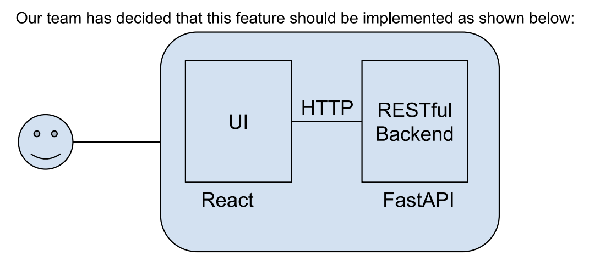

# FizzBuzzBass Game

This is a simple web application for playing the FizzBuzzBass game. The frontend is built using React and styled with Tailwind CSS, while the backend is powered by FastAPI. The frontend sends a number to the backend, and based on the number's divisibility, the backend responds with either "Fizz", "Buzz", "Bass", or the number itself.

# Prerequisites
Before running the application locally, ensure that the following software is installed on your machine:

- Node.js (for React frontend)
- Python 3.8+ (for FastAPI backend)
- npm (comes with Node.js)
- pip (for Python dependencies)

## The requirements are as follows:
- The application has one webform in the homepage.
- The form has one text field to enter a numeric value and one submit button.
- When the user enters a number that is multiple of 3 and submits the form, the UI shows the text "Fizz"
- When the user enters a number that is multiple of 5 and submits the form, the UI shows the text "Buzz"
- When the user enters a number that is multiple of 3 and 5, and submits the form, the UI shows the text "Bass"
- When the user enters any other number and submits the form, the UI shows the number given.

Application Implementation:

## Development

### Local Development

To work locally, please install the dependencies using `npm i` first.

Run `npm run dev` to start a development server and open the displayed URL in a browser.

Use `npm run test` to run the tests.

### Scripts

You can use the following commands:

- `npm run dev` to start a development server
- `npm run build` to build the project
- `npm run start` to start a production server
- `npm run test` to run the tests
<!-- - `npm run lint` to run the linter -->